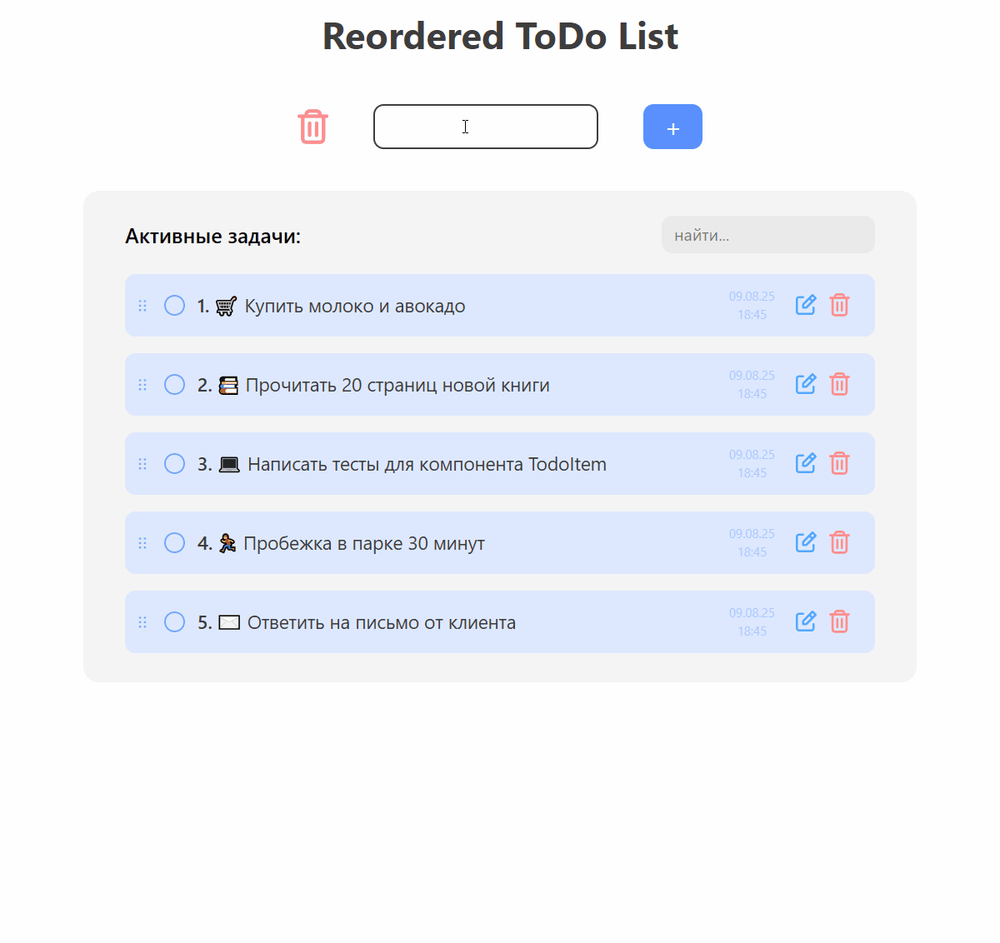

# Reordered Todo List

 

### Удобный менеджер задач с перетаскиванием, поиском и автосохранением

## ✨ Особенности
- **Drag-n-Drop** — меняйте порядок задач перетаскиванием
- **Автосохранение** — данные сохраняются в `localStorage`
- **Поиск по задачам** — мгновенный поиск в реальном времени
- **Адаптивный дизайн** — работает на любых устройствах

## 🛠 Технологии
- React + TypeScript
- Redux Toolkit
- Tailwind CSS
- Framer Motion (для DnD)
- Vite (сборка)

## 🚀 Как запустить

1. Клонируйте репозиторий:
```bash
git clone https://github.com/qjetshk/Reordered-ToDo-List.git
cd Reordered-ToDo-List
```

2. Установите зависимости:
```bash
npm install
# или
yarn
```

3. Запустите проект:
```bash
npm run dev
# или
yarn dev
```

4. Откройте проект в браузере и наслаждайтесь!
